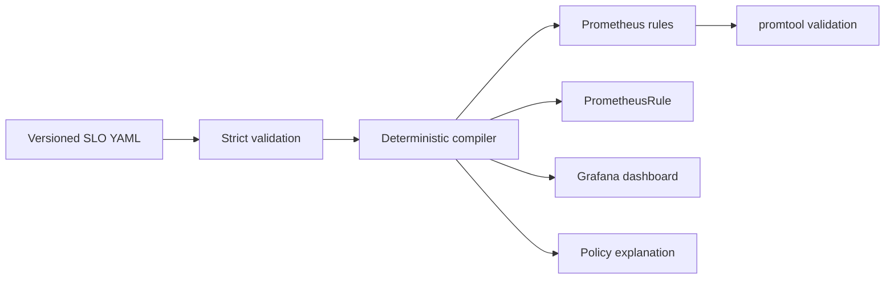

# SLO Forge

[](https://github.com/kyan9400/slo-forge/actions/workflows/ci.yml)
[](https://github.com/kyan9400/slo-forge/releases)
[](LICENSE)
[](https://pkg.go.dev/github.com/kyan9400/slo-forge)

SLO Forge turns one reviewable service-level objective into production-ready Prometheus recording rules, multi-window burn-rate alerts, a Prometheus Operator resource, a Grafana dashboard, and a plain-language policy summary.

It is designed for platform and SRE teams that want SLO policy in Git without maintaining four hand-edited representations of the same intent.



## What makes it useful

- Generates eight recording windows and four multi-window, multi-burn-rate alerts.
- Requires explicit team ownership and an HTTPS runbook before an SLO is accepted.
- Produces stable output that can be reviewed in pull requests and checked for drift.
- Supports a local CLI and a small HTTP API with health, readiness, and Prometheus metrics.
- Ships as a static, non-root container with no shell or package manager.
- Tests generated rules with the official `promtool` in CI.

## Install

Every [GitHub release](https://github.com/kyan9400/slo-forge/releases/latest) ships prebuilt binaries for Linux (`amd64`, `arm64`), macOS (`amd64`, `arm64`), and Windows (`amd64`), plus a `checksums.txt` manifest. The manifest lists assets under a `dist/` directory, so keep that name when verifying. On Linux x86-64:

```bash
base=https://github.com/kyan9400/slo-forge/releases/latest/download
curl -fsSL --create-dirs -o dist/slo-forge_linux_amd64 "$base/slo-forge_linux_amd64"
curl -fsSL -o dist/checksums.txt "$base/checksums.txt"
sha256sum --check --ignore-missing dist/checksums.txt
sudo install -m 0755 dist/slo-forge_linux_amd64 /usr/local/bin/slo-forge
slo-forge version
```

Substitute `slo-forge_linux_arm64`, `slo-forge_darwin_amd64`, `slo-forge_darwin_arm64`, or `slo-forge_windows_amd64.exe` for other platforms.

With a Go toolchain installed, build the latest tagged version from the module proxy instead:

```bash
go install github.com/kyan9400/slo-forge/cmd/slo-forge@latest
```

The container image is built from the [Dockerfile](Dockerfile) in this repository; `docker compose up --build` in the quick start below produces a local `slo-forge:local` image.

## Quick start

Validate and render the included example:

```bash
go run ./cmd/slo-forge validate -f examples/checkout-api.slo.yaml
go run ./cmd/slo-forge render -f examples/checkout-api.slo.yaml -o generated
```

The output directory contains:

```text
generated/
├── explanation.md
├── grafana-dashboard.json
├── prometheus-rules.yaml
└── prometheusrule.yaml
```

Run the API:

```bash
docker compose up --build
curl --fail http://localhost:8080/healthz
curl --fail \
  -H 'Content-Type: application/yaml' \
  --data-binary @examples/checkout-api.slo.yaml \
  http://localhost:8080/v1/render
```

## SLO definition

```yaml
apiVersion: sloforge.dev/v1alpha1
kind: ServiceLevelObjective
metadata:
  name: availability
  labels:
    team: checkout
spec:
  service: checkout-api
  target: 99.9
  window: 30d
  indicator:
    badQuery: sum(rate(http_requests_total{code=~"5.."}[{{ .window }}]))
    totalQuery: sum(rate(http_requests_total[{{ .window }}]))
  runbookURL: https://example.com/runbooks/checkout-api
```

The `{{ .window }}` token is expanded for each recording-rule window. The v1alpha1 schema deliberately supports a 30-day objective only; this keeps the generated burn-rate policy mathematically explicit. The schema is inspired by the goals of OpenSLO but is not an OpenSLO-compatible implementation.

## Alert policy

An alert fires only when both windows in a pair breach the same burn-rate threshold:

| Route | Long window | Short window | Burn rate | Hold |
|---|---:|---:|---:|---:|
| Page | 1h | 5m | 14.4x | 2m |
| Page | 6h | 30m | 6x | 15m |
| Ticket | 1d | 2h | 3x | 1h |
| Ticket | 3d | 6h | 1x | 3h |

This follows the multi-window approach described in the Google SRE Workbook: the short window catches rapid changes while the long window limits false positives.

## Commands

| Command | Purpose |
|---|---|
| `validate -f <file>` | Parse the document, reject unknown fields, and enforce policy. |
| `render -f <file> -o <dir>` | Generate all monitoring artifacts. |
| `explain -f <file>` | Print the error-budget calculation and alert policy. |
| `serve --addr :8080` | Expose the compiler over HTTP. |
| `probe --url <healthz>` | Run the container health probe. |

## Engineering notes

- [Architecture and decisions](docs/architecture.md)
- [HTTP API contract](docs/openapi.yaml)
- [v1alpha1 JSON Schema](schema/sloforge-v1alpha1.schema.json)
- [Threat model](docs/threat-model.md)
- [High burn-rate runbook](docs/runbooks/high-burn-rate.md)
- [Release process](docs/releasing.md)
- [Generated example](examples/generated/explanation.md)

## Scope

SLO Forge generates monitoring configuration; it does not apply resources to a cluster or call Grafana. Keeping generation separate from deployment makes pull-request review, GitOps reconciliation, and rollback straightforward.

## Contributing

Issues and pull requests are welcome. Start with [CONTRIBUTING.md](CONTRIBUTING.md), and report security concerns using GitHub private vulnerability reporting as described in [SECURITY.md](SECURITY.md).
