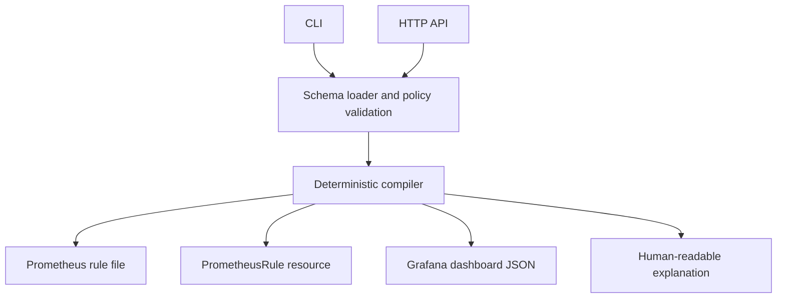

# Architecture

## Context

An SLO is usually copied into Prometheus rules, Kubernetes resources, dashboards, and documentation. Those copies drift independently. SLO Forge treats a small YAML document as the source of truth and compiles every downstream artifact deterministically.

## Components

- `internal/spec` parses YAML with unknown-field rejection and validates ownership, objective, query templates, and operational links.
- `internal/compiler` has no filesystem or network side effects. Equal input produces byte-for-byte equal output.
- `cmd/slo-forge` owns file IO, process lifecycle, and CLI ergonomics.
- `internal/server` exposes the compiler with a 1 MiB request limit and observable health and request counters.

## Reliability decisions

### Multi-window alerts

Each alert pairs a long window with a short window. Both must breach the threshold. A short-window-only alert reacts quickly but pages on transient spikes; a long-window-only alert detects real incidents too slowly.

### Record first, alert second

Bad-event ratios and burn rates are recording rules. Alert expressions remain short, dashboard queries reuse the same policy data, and Prometheus does not repeatedly execute the raw service queries for every alert.

### Generation, not mutation

The tool never connects to Kubernetes, Prometheus, or Grafana. A deployment controller or GitOps reconciler owns mutation and rollback. This also means the API can run without infrastructure credentials.

### Intentional v1alpha1 limits

Only ratio indicators and a 30-day rolling window are accepted. Latency histograms, calendar windows, and OpenSLO import require explicit semantics and are tracked as future work rather than silently approximated.

## Failure modes

| Failure | Behavior | Recovery |
|---|---|---|
| Unknown or missing field | Validation fails before generation. | Correct the source YAML. |
| Unsafe operational URL | Non-HTTPS URL is rejected. | Publish an HTTPS runbook or dashboard. |
| Invalid generated PromQL | CI fails during `promtool check rules`. | Fix the query template in the pull request. |
| API overload | Request size and server timeouts bound work. | Rate-limit at the ingress and scale stateless replicas. |
| Generated drift | CI detects a dirty `examples/generated` tree. | Re-render and review the diff. |
